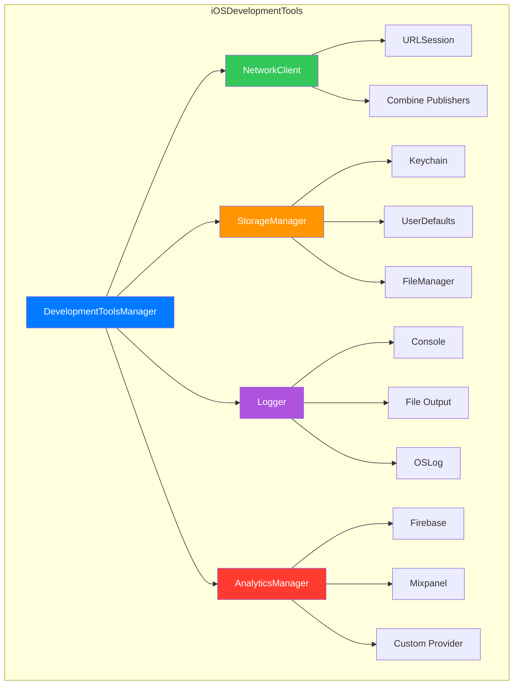

```
    ___  ____  ____    ____                 __                                  __
   /  _]/ __ \/ __/   / __ \___ _  _____   / /_____  ____  ___ ___  ___  ____  / /_
  _/ / / /_/ /\ \    / / / / -_) |/ / -_) / __/ __ \/ __ \/ _ ` _ \/ -_)/ __ \/ __/
 /___/ \____/___/   /_/_/_/\__/|___/\__/  \__/\____/\____/_/\_,_,_/\__//_/ /_/\__/
                   / /   / __ \/ __ \/ /  / ___/
                  / /   / /_/ / /_/ / /___\__ \
                 /_/    \____/\____/_____/___/
```

<p align="center">
  <strong>🛠️ Essential iOS Development Toolkit</strong>
</p>

<p align="center">
  <a href="https://swift.org"></a>
  <a href="https://developer.apple.com/ios/"></a>
  <a href="https://swift.org/package-manager/"></a>
  <a href="LICENSE"></a>
</p>

<p align="center">
  <a href="#installation">Installation</a> •
  <a href="#tools-overview">Tools</a> •
  <a href="#usage">Usage</a> •
  <a href="#documentation">Docs</a> •
  <a href="#contributing">Contributing</a>
</p>

---

## Why iOSDevelopmentTools?

Stop reinventing the wheel. This toolkit provides **battle-tested, production-ready** components that every iOS app needs:

- ✅ **Type-safe networking** with async/await and Combine support
- ✅ **Secure storage** with Keychain, UserDefaults, and encrypted file storage
- ✅ **Structured logging** with multiple output destinations
- ✅ **Analytics abstraction** supporting multiple providers
- ✅ **Utility extensions** for everyday Swift development

---

## Tools Overview

| Tool | Description | Key Features |
|------|-------------|--------------|
| 🌐 **NetworkTools** | Modern HTTP client | Async/await, Combine, retry logic, interceptors |
| 💾 **StorageTools** | Unified storage layer | Keychain, UserDefaults, file storage, encryption |
| 🔍 **DebugTools** | Structured logging | Multi-level, file/console/remote output |
| 📊 **AnalyticsTools** | Analytics abstraction | Multi-provider, event tracking, user properties |
| 🧰 **UtilityTools** | Swift extensions | String, Date, Array, UIKit helpers |
| ⚙️ **Core** | Framework lifecycle | Configuration, initialization, state management |

---

## Architecture



---

## Installation

### Swift Package Manager

Add to your `Package.swift`:

```swift
dependencies: [
    .package(url: "https://github.com/muhittincamdali/iOSDevelopmentTools.git", from: "1.0.0")
]
```

Or in Xcode: **File → Add Package Dependencies** → paste the URL.

### Import

```swift
import iOSDevelopmentTools
```

---

## Usage

### Quick Start

```swift
import iOSDevelopmentTools

// Initialize on app launch
iOSDevelopmentTools.configure(
    networkBaseURL: "https://api.example.com",
    analyticsEnabled: true,
    loggingEnabled: true
)
```

---

## 🌐 NetworkTools

Modern, type-safe HTTP client with async/await support.

### Basic Requests

```swift
let client = NetworkClient.shared

// GET request
let users: [User] = try await client.get("/users")

// POST request
let newUser: User = try await client.post("/users", body: [
    "name": "John Doe",
    "email": "john@example.com"
])

// PUT request
let updated: User = try await client.put("/users/123", body: updatedData)

// DELETE request
let _: EmptyResponse = try await client.delete("/users/123")
```

### Advanced Configuration

```swift
let config = NetworkConfiguration(
    baseURL: "https://api.example.com",
    timeout: 30,
    retryCount: 3,
    headers: [
        "Authorization": "Bearer \(token)",
        "X-API-Version": "2.0"
    ]
)

NetworkClient.shared.configure(with: config)
```

### Custom Request with Combine

```swift
struct APIRequest {
    let path: String
    let method: HTTPMethod
    let headers: [String: String]?
    let body: Encodable?
}

let request = APIRequest(
    path: "/users/search",
    method: .post,
    headers: ["X-Custom": "value"],
    body: SearchQuery(term: "swift")
)

let response: APIResponse<[User]> = try await client.perform(request)
print("Found \(response.data.count) users")
```

### File Upload/Download

```swift
// Upload
let imageData = UIImage(named: "avatar")!.jpegData(compressionQuality: 0.8)!
let url: UploadResponse = try await client.upload(
    "/upload/avatar",
    data: imageData,
    mimeType: "image/jpeg"
)

// Download
let fileData = try await client.download("/files/document.pdf")
```

---

## 💾 StorageTools

Unified storage layer supporting Keychain, UserDefaults, and file storage.

### UserDefaults

```swift
let storage = StorageManager.shared

// Save
try storage.save("John Doe", forKey: "username")
try storage.save(true, forKey: "onboarded")
try storage.save(["swift", "ios"], forKey: "skills")

// Retrieve
let username: String? = try storage.retrieve(String.self, forKey: "username")
let skills: [String]? = try storage.retrieve([String].self, forKey: "skills")

// Check existence
if storage.exists(forKey: "username") {
    print("User exists")
}

// Remove
try storage.remove(forKey: "username")
```

### Keychain (Secure Storage)

```swift
let keychain = StorageManager.shared.keychain

// Store sensitive data
try keychain.save("secret_token_123", forKey: "auth_token")
try keychain.save("refresh_token_456", forKey: "refresh_token")

// Retrieve
let token: String? = try keychain.read(forKey: "auth_token")

// Delete
try keychain.delete(forKey: "auth_token")

// Delete all
try keychain.clear()
```

### Encrypted File Storage

```swift
let config = StorageConfiguration(
    encryptionEnabled: true,
    encryptionKey: "your-256-bit-key",
    compressionEnabled: true
)

let secureStorage = StorageManager(configuration: config)

// Store large objects securely
let userData = UserProfile(name: "John", data: largeData)
try secureStorage.save(userData, forKey: "user_profile")

// Backup and restore
let backup = try secureStorage.backup()
try secureStorage.restore(from: backup)
```

---

## 🔍 DebugTools

Structured logging with multiple output destinations.

### Basic Logging

```swift
let logger = Logger.shared

logger.debug("Fetching user data...")
logger.info("User logged in successfully")
logger.warning("Cache is getting full")
logger.error("Failed to save file: \(error)")
logger.critical("Database connection lost!")
```

### Output Example

```
🔍 [2025-01-28 14:23:45.123] [DEBUG] [ViewModel.swift:42] fetchData(): Fetching user data...
ℹ️ [2025-01-28 14:23:45.456] [INFO] [AuthService.swift:78] login(): User logged in successfully
⚠️ [2025-01-28 14:23:46.789] [WARNING] [CacheManager.swift:156] checkSize(): Cache is getting full
❌ [2025-01-28 14:23:47.012] [ERROR] [FileService.swift:89] save(): Failed to save file
🚨 [2025-01-28 14:23:47.345] [CRITICAL] [Database.swift:23] connect(): Database connection lost!
```

### Custom Logger Configuration

```swift
let customLogger = Logger(subsystem: "com.myapp.networking")

// Log levels filter automatically based on build configuration
#if DEBUG
customLogger.minimumLevel = .debug
#else
customLogger.minimumLevel = .warning
#endif
```

---

## 📊 AnalyticsTools

Analytics abstraction layer supporting multiple providers.

### Event Tracking

```swift
let analytics = AnalyticsManager.shared

// Track simple event
analytics.trackEvent("button_tapped", parameters: [
    "button_name": "purchase",
    "screen": "product_detail"
])

// Track screen view
analytics.trackScreen("ProductDetail", parameters: [
    "product_id": "12345",
    "category": "electronics"
])

// Track errors
analytics.trackError(error, parameters: [
    "context": "checkout_flow",
    "step": "payment"
])
```

### User Properties

```swift
// Set user ID
analytics.setUserId("user_12345")

// Set user properties
analytics.setUserProperty("premium", forKey: "subscription_tier")
analytics.setUserProperty("ios", forKey: "platform")
```

### Multiple Providers

```swift
// Add Firebase provider
analytics.addProvider(FirebaseAnalyticsProvider())

// Add Mixpanel provider
analytics.addProvider(MixpanelProvider(token: "your_token"))

// Add custom provider
class CustomAnalyticsProvider: AnalyticsProvider {
    var id: String { "custom" }
    
    func trackEvent(_ event: AnalyticsEvent) {
        // Send to your backend
    }
}
analytics.addProvider(CustomAnalyticsProvider())
```

---

## 🧰 UtilityTools

Handy Swift extensions for everyday development.

### String Extensions

```swift
// Validation
"test@example.com".isValidEmail     // true
"5551234567".isValidPhoneNumber     // true
"abc123".isAlphanumeric             // true

// Transformation
"  hello world  ".trimmed           // "hello world"
"hello".capitalizedFirst            // "Hello"

// Truncation
"Long text here".truncate(to: 8)    // "Long tex..."

// Sanitization
"hello@world!".removeSpecialCharacters()  // "helloworld"
```

### Date Extensions

```swift
let date = Date()

// Checks
date.isToday           // true
date.isYesterday       // false
date.isTomorrow        // false

// Components
date.startOfDay        // Today at 00:00:00
date.endOfDay          // Today at 23:59:59
date.startOfWeek       // First day of current week
date.startOfMonth      // First day of current month
```

### Collection Extensions

```swift
let array = [1, 2, 3, 4, 5]

// Safe subscript (no crash on out-of-bounds)
array[safe: 10]        // nil

// Unique elements
[1, 2, 2, 3, 3].unique // [1, 2, 3]

// Chunking
array.chunked(into: 2) // [[1, 2], [3, 4], [5]]
```

### UIColor Extensions

```swift
// From hex
let color = UIColor(hex: "#FF5733")
let color2 = UIColor(hex: "007AFF")

// With alpha
let transparentColor = UIColor(hex: "#FF5733", alpha: 0.5)
```

### UIView Extensions

```swift
// Corner radius
view.roundCorners(radius: 12)

// Shadow
view.addShadow(
    color: .black,
    opacity: 0.2,
    offset: CGSize(width: 0, height: 2),
    radius: 8
)

// Border
view.addBorder(color: .gray, width: 1)
```

---

## Project Structure

```
iOSDevelopmentTools/
├── Sources/
│   ├── Core/
│   │   └── MainFramework.swift
│   ├── NetworkTools/
│   │   └── NetworkClient.swift
│   ├── StorageTools/
│   │   └── StorageManager.swift
│   ├── DebugTools/
│   │   └── Logger.swift
│   ├── AnalyticsTools/
│   │   └── AnalyticsManager.swift
│   └── UtilityTools/
│       └── UtilityExtensions.swift
├── Tests/
│   ├── UnitTests/
│   ├── IntegrationTests/
│   └── PerformanceTests/
├── Examples/
│   ├── BasicExample.swift
│   └── AdvancedExample.swift
└── Documentation/
```

---

## Requirements

| Requirement | Version |
|-------------|---------|
| iOS | 15.0+ |
| macOS | 12.0+ |
| Xcode | 15.0+ |
| Swift | 5.9+ |

---

## Documentation

Full documentation is available in the [Documentation](Documentation/) folder:

- [Getting Started Guide](Documentation/GettingStarted.md)
- [API Reference](Documentation/APIReference.md)
- [Migration Guide](Documentation/MigrationGuide.md)
- [Best Practices](Documentation/BestPractices.md)

---

## Contributing

Contributions are welcome! Please read [CONTRIBUTING.md](CONTRIBUTING.md) before submitting PRs.

1. Fork the repository
2. Create your feature branch (`git checkout -b feature/amazing-feature`)
3. Commit your changes (`git commit -m 'feat: add amazing feature'`)
4. Push to the branch (`git push origin feature/amazing-feature`)
5. Open a Pull Request

---

## License

This project is licensed under the MIT License - see [LICENSE](LICENSE) for details.

---

## Author

**Muhittin Camdali** — [@muhittincamdali](https://github.com/muhittincamdali)

---

<p align="center">
  <sub>Built with ❤️ for the iOS community</sub>
</p>

---

## 📈 Star History

<a href="https://star-history.com/#muhittincamdali/iOSDevelopmentTools&Date">
 <picture>
   <source media="(prefers-color-scheme: dark)" srcset="https://api.star-history.com/svg?repos=muhittincamdali/iOSDevelopmentTools&type=Date&theme=dark" />
   <source media="(prefers-color-scheme: light)" srcset="https://api.star-history.com/svg?repos=muhittincamdali/iOSDevelopmentTools&type=Date" />
   
 </picture>
</a>
